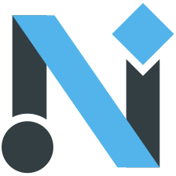
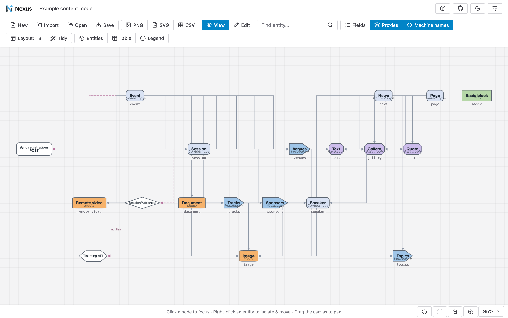

<p align="center">
  
</p>

<h1 align="center">Nexus</h1>

<div align="center">

Draw a Drupal site's content model as an interactive diagram - entirely in your browser.

[](https://github.com/drevops/nexus/issues)
[](https://github.com/drevops/nexus/pulls)
[](https://github.com/drevops/nexus/actions/workflows/test-nodejs.yml)
[](https://github.com/drevops/nexus/actions/workflows/release.yml)


</div>

---

Nexus is a static web app. Drop a Drupal **exported configuration folder** onto the page and it reconstructs the site's logical content model - bundles, fields and entity-reference relationships - and draws it on an infinite, pannable canvas. From there you can edit the model, or start one from scratch or from a template, and save it as a document to open again later. **Everything runs client-side: your configuration never leaves the browser.** None of it is uploaded to any server, which makes it safe to point at client work.

**[Open the app →](https://nexus.drevops.com/)**



## Features

- **100% client-side.** Parsing and rendering happen in the browser; no backend, no upload, no install.
- **Drop a folder.** Choose or drag a config sync directory (or a module's `config/install`). Nexus reads only its YAML files, locally.
- **Start from a template.** Load the content model of Drupal CMS or CivicTheme in 1 click, each pinned to a release (see [Templates](#templates)).
- **Faithful visual language.** Each entity type has its own colour and shape, and single / multi / system / calculated fields and Event / API / Callback annotations each have their own symbol (see the [legend](#the-visual-language)).
- **Browsable.** Opens with every field and machine name on show, with tools to collapse it to an entity-only overview, filter by entity type, find and focus an entity, and read a searchable field table.
- **Editable.** Add entities, fields, references, events, APIs and callbacks in Edit mode, rename machine names and attach notes - or build a model from scratch.
- **Undo and history.** Undo and redo your edits, and step back to an earlier version of the diagram from the History panel.
- **Saved as a document.** Save the diagram, layout and all, as a `.nexus.json` file and open it again later.
- **Customisable & remembered.** Switch between light and dark themes, recolour entity types, swap their symbols or add types of your own; the choices persist in your browser and apply to every diagram you open.
- **Export.** Export the whole canvas as **PNG** or **SVG**, or the field table as **CSV** - all client-side. The Export button remembers the last format you picked, so the next export takes 1 click.

## Installation

There's nothing to install: [open the app](https://nexus.drevops.com/) in a modern browser.

To host your own copy, serve `index.html`, `src/`, `assets/` and `templates/` from any static web server. Opening `index.html` straight from disk won't work, because browsers don't load ES modules over `file://`.

## Usage

1. Open the app (or your own copy - see [Installation](#installation)). The light/dark theme toggle sits in the top-right corner of the landing screen too, so you can pick a theme before loading anything.
2. **Choose a config folder** or drag one onto the drop zone - the folder of `*.yml` files exported from a Drupal site (its config sync directory), or a module's `config/install`. Or pick one of the [templates](#templates) beside it, **Open a saved diagram** or **Start from scratch**.
3. Explore with the toolbar, switch to **Edit** to change the model, then **Save** it or export it as PNG, SVG or CSV.

Add an `annotations.yml` file to the folder to overlay [events, APIs and callbacks](#annotation-overlay).

## Templates

No config export to hand? The landing screen offers 2 ready-made content models:

| Template | Version | What it draws |
|----------|---------|---------------|
| [Drupal CMS](https://www.drupal.org/project/cms) | 2.2.2 | Drupal CMS with its Byte site template: a utility page, a blog post, tags and 5 media types |
| [CivicTheme](https://www.drupal.org/project/civictheme) | 1.13.0 | The government design system: 3 content types built from 31 paragraph types, plus its media types, vocabularies and blocks |

Each template is drawn from the configuration of an exact release and ships as a saved diagram in `templates/`, so it opens just like a diagram you've saved yourself. Drupal CMS builds its landing pages with Canvas rather than a content type, so those pages don't appear in its diagram. CivicTheme and Drupal CMS are released under GPL-2.0-or-later, like Nexus.

## The visual language

The page renders a legend describing every symbol. Nexus derives entities, fields and references from configuration. Event, API, Callback and Calculated symbols come from an optional [annotation overlay](#annotation-overlay), and Edit mode can add events, APIs and callbacks too.

| Symbol | Meaning | Source |
|--------|---------|--------|
| Colored shape, set per entity type | An entity bundle - content type, vocabulary, media, paragraph, block, user or external entity | Config |
| Faded copy of an entity, dashed border | A proxy: a reference's target, drawn beside the field that references it | Config |
| Ellipse, solid border | Single-value field | Config |
| Ellipse, double border | Multi-value field | Config |
| Ellipse, dashed border | System (base) field | Curated per entity type |
| Ellipse, yellow fill | Calculated field | Annotation |
| Diamond | Event | Annotation |
| Hexagon | API | Annotation |
| Rectangle with a method | Callback | Annotation |

By default, content types are rounded rectangles, vocabularies are tags, media are barrels, paragraphs are cut rectangles, blocks are rectangles, users are ellipses and external entities are hexagons; **Settings** changes the color and shape of any type. A field label ending in `*` marks a required field, and reference arrows carry the field's cardinality: `1`, `1..N` for a limit of N, or `1..n` for unlimited.

## Navigating the diagram

The diagram opens with its entities stacked in columns that fill the screen, with every field, proxy and machine name on show. The toolbar offers:

- **Find entity** - type a name, then press Enter or the search button to fade everything else and zoom to the matches.
- **Fields** - hide the fields to collapse the diagram to an entity-only overview, or show them again.
- **Proxies** - draw each reference as a faded copy of its target beside the field, or as an edge to the entity itself.
- **Machine names** - show each bundle/field machine name in monospace beneath its symbol.
- **Layout** - re-run the current layout, or pick another from the arrow beside it: **Columns** stacks each entity and its fields in columns that fill the screen, grouped by entity type, while **LR** and **TB** lay the whole diagram out as 1 flow, left to right or top to bottom. Your pick is remembered.
- **Tidy** - straighten each entity's fields and line the entities up in columns near where they already are, so a diagram you've dragged around or edited gets neat without being rearranged. Drag an entity roughly into place and Tidy slots it in.
- **Entities** - an index with per-type filters and field counts; click a bundle to focus it or open its fields.
- **Table** - a searchable table of all fields (or a single entity's) with type, cardinality, requiredness and references.
- **Legend** - what each symbol means.
- **History** - the versions of the diagram since you opened it, up to your last 200 changes (see [Undo and history](#undo-and-history)).
- **Undo / Redo** - step back and forward through your changes.
- **Export** - export the whole canvas as PNG or SVG, or the field table as CSV. Pick a format from the arrow beside it and the button keeps that format, so the next press exports it straight away.

The top-right corner holds the About box, a link to this repository, the light/dark theme toggle and **Settings**, where you choose each entity type's colour and symbol or add types of your own. The status bar holds the zoom controls - **Reset**, **Fit**, zoom out, zoom in and a zoom-level menu - and the mouse wheel zooms while dragging the canvas pans. Click a node to focus it and its connections, and right-click an entity to isolate it so it moves together with its fields.

Panels float over the canvas. Drag one by its header, or drop it at the left or right edge (or click its pin) to dock it in a side rail that you can resize.

## Editing

Switch to **Edit** and a palette appears under the toolbar:

- **Content**, **Vocab**, **Media**, **Para**, **Block**, **User** and **External** add an entity. Click one to fill in a form, or drag it onto the canvas to drop one in place.
- **Field** adds a field to an entity and can reuse the definition of a field that already exists. The **+** handles around a selected entity add a field in a single click.
- **Event**, **API** and **Callback** place an annotation: click one and then the canvas, or drag it into place.
- **Connect** lets you drag from a field to an entity to create a reference.

Select a node to edit or delete it in the **Inspector**: an entity's label and machine name; a field's label, machine name, type, cardinality, required flag and references; or an annotation's label, kind and method. Any node can also carry a free-text note, shown as a badge on the canvas.

## Undo and history

**Undo** and **Redo** in the toolbar step back and forward through your changes, and so do `Ctrl+Z` and `Ctrl+Shift+Z` or `Ctrl+Y` (`⌘Z` and `⇧⌘Z` on a Mac). Every change to the diagram counts: adding, renaming and deleting entities, fields, references and annotations, editing them in the Inspector, dragging nodes, **Tidy** and renaming the diagram. Typing into a field is 1 step, however many characters it takes. While a text box has the focus, the shortcuts undo your typing there instead.

**History** opens a panel listing the versions of the diagram since you opened it, newest first, with the time of each change. It keeps your last 200 changes, so in a longer session the oldest ones leave the list. Click a version to go back to it. The versions after it stay in the list, greyed out, so you can jump forward again until your next edit replaces them.

Undo covers what the diagram holds, not how it's shown, so it leaves the **Fields**, **Proxies** and layout direction toggles and the entity type filters alone, along with your colours, symbols and custom types. The history lives in memory only: it isn't saved with the document, and it starts over when you open, import or start another diagram.

## Saving diagrams

**Save** downloads the diagram as a `.nexus.json` document holding the model, its layout, the entity colours and symbols, any custom types and the panel arrangement, and **Open** brings it back with every node where you left it. The title box at the top left names the diagram and the files it saves and exports. **New** starts an empty model, and **Import** returns to the import screen to load another config folder or template.

## Annotation overlay

Some architecture is not expressed in Drupal configuration - integration callbacks, external APIs and domain events. Include a YAML overlay named `annotations.yml` (or `nexus.annotations.yml`) in the folder. This one describes a conference site:

```yaml
title: 'Example content model'
nodes:
  - id: ticketing_api
    kind: api
    label: 'Ticketing API'
  - id: sync_registrations
    kind: callback
    label: 'Sync registrations'
    method: POST
    attach: node.event
  - id: session_published
    kind: event
    label: SessionPublished
    attach: node.session
edges:
  - { from: session_published, to: ticketing_api, label: notifies }
computed_fields:
  node.session:
    - { name: duration, label: 'Duration' }
```

- `title` names the diagram.
- `nodes` add Event (`event`), API (`api`) or Callback (`callback`) nodes; a missing or unknown `kind` becomes `event`. `attach` draws an edge from an existing entity, `method` adds a second label line such as an HTTP verb, and `note` adds a note badge.
- `edges` draw explicit links between any 2 nodes.
- `computed_fields` add calculated fields to an existing entity, keyed by its `entity_type.bundle` id.

## Contributing

See [`CONTRIBUTING.md`](CONTRIBUTING.md) for local development setup, the linting and testing commands, the Netlify previews for pull requests, how a release deploys to GitHub Pages and how to pull in template updates.

## Privacy

Nexus has no backend. The configuration you import and the diagrams you build stay in your browser's memory and leave it only when you save or export a file; nothing is uploaded to or processed by any server. Your preferences - theme, panel layout, diagram layout, entity colours and symbols, custom entity types and the last export format - are kept in the browser's `localStorage`.

Nexus is provided as is, without warranty of any kind, and the authors accept no responsibility or liability for any data you load into it or create with it.

## License

Nexus is free software, released under the [GNU General Public License, version 2 or later](LICENSE) (GPL-2.0-or-later), matching the Drupal ecosystem it serves.

---
_Rendered with [Cytoscape.js](https://js.cytoscape.org/) and [Dagre](https://github.com/dagrejs/dagre), with a UI built on [Preact](https://preactjs.com/) and [Shoelace](https://shoelace.style/); YAML via [js-yaml](https://github.com/nodeca/js-yaml) and icons from [Lucide](https://lucide.dev/)._

_This repository was created using the [Scaffold](https://getscaffold.dev/) project template_
