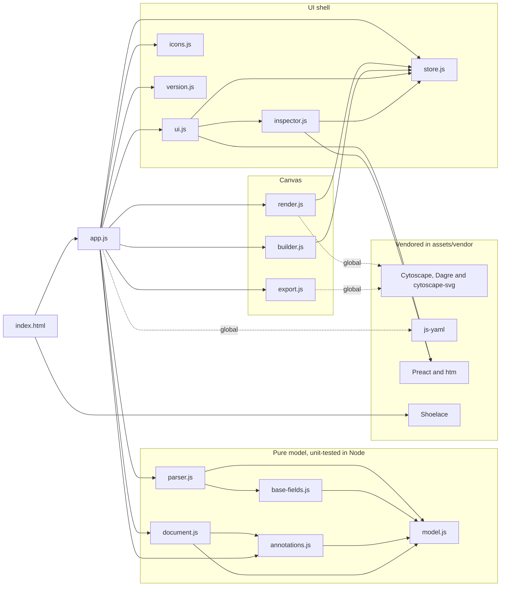
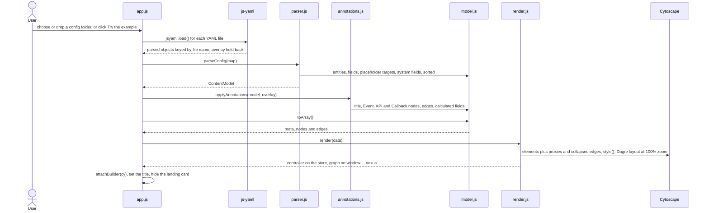
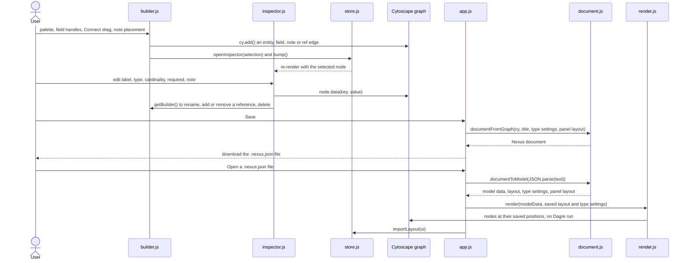
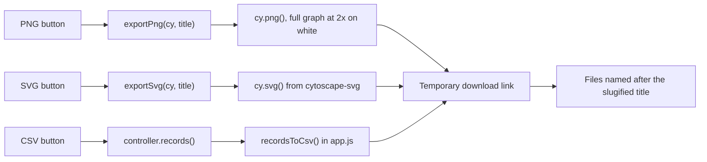

# Architecture

This is a walkthrough of how this project works: what ships to the browser, and how the primary flows run from a folder of exported Drupal configuration to the diagram on screen and back out as a saved document or an export. Each section is derived from the page, modules and workflows it names, and diagrams are embedded where the prose discusses them.

This document is generated and maintained by an AI agent via the `update-architecture-docs` skill in `.claude/skills/update-architecture-docs/SKILL.md`. The content is derived from the source code. If this documentation and the code disagree, the code wins.

## The shape of the app

Nexus is a static page with no build step and no backend. `index.html` loads the vendored libraries from `assets/vendor/` as classic scripts, so Cytoscape, Dagre with its `cytoscape-dagre` adapter, `cytoscape-svg` and js-yaml all land on `window`. The last script is `assets/app.js`, loaded as an ES module, which is why the app needs HTTP and won't run from `file://`.

An import map points the bare `preact`, `preact/hooks` and `htm` specifiers at their vendored ES modules. Before the Shoelace autoloader runs, an inline module pins Shoelace's base path to an absolute URL, so the web components resolve whether the page is served from a domain root or from the `/nexus/` subpath on GitHub Pages.

`app.js` is the composition root. When it loads, it wires the landing card, the document and export buttons, the theme toggle, the status bar hints and the About dialog, and writes the version from `version.js` into every `[data-version]` element. It also calls `initUI()` to mount the Preact shell, `initBuilder()` to wire edit mode and `initIcons()` to fill every `[data-icon]` control with an inline SVG from `icons.js`.

The modules fall into 3 groups:

- The pure model: `parser.js`, `model.js`, `base-fields.js`, `annotations.js` and `document.js` turn configuration and saved documents into a `ContentModel` and its renderable `meta`, `nodes` and `edges`. None of them touches the DOM or a global, which is what lets the unit tests import them straight into Node.
- The canvas: `render.js` owns the Cytoscape instance and the visual language, `builder.js` layers the editing gestures on top of it, and `export.js` writes PNG and SVG files.
- The UI shell: `store.js` is a small observable shared by the canvas and the shell, `ui.js` renders the panels around the canvas with Preact and htm, and `inspector.js` holds the edit-mode forms built from Shoelace controls. `icons.js` and `version.js` support it.

The modules share state through the store rather than through each other's internals. Every `render()` publishes a controller on the store with what the panels need: focus, search, layout, type colors and symbols, the entity list and the field records behind the Fields table. `attachBuilder()` publishes the builder's mutations the same way, so the inspector can create, rename and delete without importing `builder.js`. 2 globals cover the rest: `window.__nexus` holds the live graph for `app.js` and the e2e tests, and `window.__nexusBuild` tells `render.js` to leave taps to the builder while edit mode is on.

Your data stays in the browser. The live diagram exists only in memory, and `localStorage` keeps 3 things: type colors, symbols and custom types under `nexusSettings`, the panel layout under `nexusLayout` and the theme under `nexusTheme`. Diagrams aren't autosaved, so a reload starts again at the landing card and Save is how you keep your work. The only requests the app makes are for its own static files: the modules, Shoelace's component chunks and, when you try the example, the bundled example's manifest and YAML.

## From a config folder to a diagram

There are 3 ways in, and they all end in the same map. Choosing a folder uses a `webkitdirectory` file input. Dropping one on the landing card walks the dropped directory tree through `webkitGetAsEntry()`, falling back to the flat file list when the browser doesn't offer entries. Try the example fetches `examples/example/manifest.json`, then every file it lists from `examples/example/config/`, then the optional `examples/example/annotations.yml`.

For a folder, `app.js` keeps only `.yml` and `.yaml` files, parses each with js-yaml and keys the result by the file's base name. Files that don't parse are skipped, and a file named `annotations.yml` or `nexus.annotations.yml` is held back as the overlay. Because the key is the base name, 2 files with the same name in different subfolders collide, and the last one read wins. The Import button reopens the same landing card over an existing diagram, with a Cancel button to go back to it.

`parseConfig()` then builds the `ContentModel` in 6 passes:

1. Bundle files become entities. The parser recognizes 5 prefixes, `node.type.`, `taxonomy.vocabulary.`, `media.type.`, `paragraphs.paragraphs_type.` and `block_content.type.`, and takes each label from the file's `name` or `label` key, falling back to the machine name in title case.
2. `field.storage.*` files record each field's type, cardinality and reference target type.
3. `field.field.*` files become fields on their bundle: single-value when the storage cardinality is 1, multi-value otherwise, with target bundles read from `handler_settings.target_bundles` for `entity_reference` and `entity_reference_revisions` fields. Only the entity types Nexus draws are read (`node`, `taxonomy_term`, `media`, `paragraph`, `block_content`, `user` and `external`), so comment fields, for example, are skipped. A field on a bundle with no bundle file creates that entity on the spot, which is how `user.user` shows up.
4. Reference targets missing from the config become placeholder entities. A reference with no target bundles points at an open-ended placeholder such as `paragraph.*`, labeled "Any Paragraph".
5. Curated system fields from `base-fields.js` are prepended to every entity except the open-ended placeholders, for example `title`, `uid`, `status` and `created` on content types. They're display-only: `uid` and `roles` are typed `entity_reference` but carry no target, so they never draw a reference edge.
6. Entities are sorted by type (content types, vocabularies, media, paragraphs, blocks, users, external, then anything else) and then by machine name. Within an entity, system fields come first and the rest follow alphabetically, so the same input always produces the same output.

`applyAnnotations()` then lays the overlay on top. A `title` renames the model, each entry in `nodes` becomes an Event, API or Callback node (an unknown `kind` falls back to Event), `attach` draws an edge to it from the entity it names, `edges` add explicit links, and `computed_fields` appends calculated fields to entities that already exist.

Finally `toArray()` flattens the model into Cytoscape elements: entity nodes with ids like `node.article`, field nodes like `field:node.article:field_tags`, `has` edges from each entity to its fields, and `ref` edges from a field to its targets, labeled by `cardinalityLabel()` as `1`, `1..3` or `1..n`. If the folder held no YAML, or the parse found no entities, the landing card shows an error instead of an empty canvas.

`render()` turns the model into a live graph. `buildElements()` derives 2 extra kinds of element from the `ref` edges: a proxy, a faded copy of the target entity attached to each referencing field so a distant reference reads as a short local hop, and a `collapsed` edge per referenced entity pair for the overview with fields hidden. It then creates the Cytoscape instance in `#cy`, switches Fields, Proxies and Machine names on, runs the Dagre layout over the visible elements and centers the view at 100% zoom.

Proxies, their edges and the collapsed edges are derived once per render. Edit-mode changes to references or cardinality don't reach them until the diagram is opened again.

## How the canvas draws a model

`style()` in `render.js` maps every node and edge group to the diagram's visual language:

| Element | Drawn as |
|---|---|
| Entity | The type's symbol, filled with the type's color, with the type name as a caption inside |
| Single-value field | Ellipse with a solid border |
| Multi-value field | Ellipse with a double border |
| System field | Ellipse with a dashed border and muted text |
| Calculated field | Yellow ellipse |
| Event, API, Callback | Diamond, hexagon and rounded rectangle, with any method on a second line |
| Proxy | Faded, dashed copy of the target entity's symbol |
| `has` edge | Plain line from an entity to its field |
| `ref` and `proxyedge` edges | Arrow from a field, labeled with the cardinality |
| `collapsed` edge | Arrow from entity to entity while fields are hidden |
| `annotation` edge | Dashed arrow with its label |

By default content types are rounded rectangles, vocabularies are tags, media are barrels, paragraphs are cut rectangles, blocks are rectangles, users are ellipses and external entities are hexagons. A required field's label ends with an asterisk. Settings offers 11 symbols, and the colors, symbols and custom entity types you set there are stored under `nexusSettings` and reused for every diagram you open.

Toggles change visibility, never the graph. `refresh()` hides whatever the current mode excludes: field nodes and `has` edges need Fields on, proxies need both Fields and Proxies, plain `ref` edges show only with Fields on and Proxies off, and `collapsed` edges only with Fields off. The type checkboxes in the Entities panel hide whole entity types the same way. Layout (LR or TB) and Tidy re-run Dagre, while Fit, the zoom buttons and the zoom-level menu only move the viewport, and Reset also clears the focus.

In View mode, clicking an entity fades everything more than 2 hops away from it, and clicking a field traces its owner and its reference targets in teal. Clicking a proxy focuses the real target entity, and clicking empty canvas clears the focus. Search matches entity labels and machine names when you press <kbd>Enter</kbd> or click the search button, fades everything else and animates to the match at 100% zoom.

Cytoscape gives each label a single style, so anything styled differently lives in HTML layers stacked over the canvas: the type caption inside each entity, the machine names under each symbol, note badges, the edit-mode `+` handles and the hover tooltip. Captions and note badges are repositioned on Cytoscape's `render` event, at most once per animation frame, and they're hidden below 35% zoom.

## The UI shell

`ui.js` mounts 1 Preact tree into `#stage-root`: a dock rail on each side, the canvas host in the middle and a layer of floating panels. The canvas host's `shouldComponentUpdate()` always returns false, so Preact renders `#cy` and the overlay containers once and never touches them again. From then on Cytoscape and the overlay code own that DOM.

The 5 panels are Entities, Fields (opened by the Table button), Settings (the sliders icon), Legend and Inspector. You drag a panel by its header, and dropping it within 90 px of the stage's left or right edge docks it into that side's rail, where docked panels stack and scroll independently. The rail width and a docked panel's height are both resizable, and the stage calls `cy.resize()` whenever the docks change, so the canvas keeps filling the space between them.

Panel bodies hold no model state. They read the graph through the controller on every render, and anything that edits the graph calls `bump()`, which increments the store's version counter and re-renders every subscriber. `store.js` also keeps the panel windowing (which panels are open, where they float or dock, their heights and the dock widths), the inspector's selection and the Fields table filter.

Every store change schedules a write of the panel layout to `nexusLayout`, batched to at most 1 write every 400 ms, and on a first visit only the Legend starts open. The theme toggle adds `sl-theme-dark` to the root element, restyles the graph for the dark palette and stores the choice under `nexusTheme`. Without a stored choice, the theme follows the system's color scheme.

## Editing, saving and reopening a diagram

Once a diagram is on screen, the live Cytoscape graph is the source of truth. There's no separate model to keep in sync: edits change the graph, and saving reads it back. New, or Start from scratch on the landing card, renders an empty model titled "New content model" to build from.

The Edit button turns on build mode. `builder.js` sets `window.__nexusBuild`, shows the palette row, makes nodes draggable and switches Fields on so every field is visible. Switching modes in either direction drops any focus or isolation, and going back to View also closes the inspector.

Build mode adds elements in several ways:

- The Content, Vocab, Media, Para, Block and User buttons open a new-entity form in the inspector. Dragging one onto the canvas instead creates the entity where you drop it, with a generated machine name such as `content_type_1`.
- The Field button opens the new-field form, which suggests every field machine name already in the diagram and copies the label, type and cardinality of the one you pick. Dropping the Field button on the canvas creates a field right away on the entity under the drop, or the nearest one, and so does clicking any of the 4 `+` handles around a selected entity. These fields get generated names: `field_1`, `field_2` and so on.
- The Event, API and Callback buttons place a note at your next click on empty canvas, or wherever you drop them.
- Connect lets you drag from a field to an entity to add a reference, and the target list in a reference field's inspector does the same from a form.

The inspector writes most edits straight into the node's data: labels, a field's type, cardinality and required flag, an annotation's kind and method, and notes on anything. Changing cardinality also flips the field between single and multi and relabels its `ref` edges. Structural changes go through the builder API on the store: creating, deleting, adding or removing references, and renaming machine names. A rename re-creates the node under its new id and migrates its `has` and `ref` edges, and renaming an entity carries its fields along.

Right-clicking an entity, in either mode, isolates it with its fields and their proxies, fades everything else and lets you drag the group as 1 unit. Clicking empty canvas releases it.

Save calls `documentFromGraph()` to walk the live graph, then downloads the result as a `.nexus.json` document named after the slugified title. Reference targets aren't stored on the field nodes, so `documentFromGraph()` reads them back from each field's outgoing `ref` edges. The document holds:

| Key | Holds |
|---|---|
| `nexus` | The format version, currently `1` |
| `title` | The diagram title |
| `colors`, `symbols`, `customTypes` | The type colors and symbols in use, plus any custom entity types |
| `entities` | Each entity's type, bundle, label and note, with its fields: name, label, type, kind, cardinality, required flag, note and reference targets |
| `annotations` | The Event, API and Callback nodes, plus every annotation edge |
| `layout` | The canvas position of every node except proxies |
| `ui` | The panel layout from `exportLayout()` |

Open runs the same path backwards. `documentToModel()` checks that `entities` is an array, rebuilds a `ContentModel` and replays the annotations through `applyAnnotations()`. A field saved without a cardinality falls back to `-1` when it's multi-value and `1` otherwise.

Because the document carries a layout, `render()` puts every saved node back where it was instead of running Dagre, and `importLayout()` restores the panels. Proxies aren't saved, so after an open they keep their starting grid positions until you click Tidy. The document's colors and symbols apply to that diagram without overwriting your saved settings, and a file that isn't a valid Nexus document reopens the landing card with an error.

## Exports

All 3 exports are built in the browser and handed to you through a temporary download link, so nothing is uploaded. PNG uses Cytoscape's own `cy.png()` on the full graph at 2x scale on a white background. SVG uses `cy.svg()` from the `cytoscape-svg` extension, which `export.js` registers when it loads.

CSV comes from `app.js`, which turns the controller's field records into 8 columns: Entity, Entity type, Field, Machine name, Field type, Cardinality, Required and References. Values containing a quote, comma or newline are quoted, and the file covers every field in the diagram, whatever the current filters show. Each export is named after the slugified title, so a diagram titled "Example content model" exports `example-content-model.png`, `example-content-model.svg` and `example-content-model-fields.csv`.

## How Nexus is verified and shipped

The pure modules are unit-tested with Node's built-in test runner. `npm run test-unit` runs `node --test` over `tests/unit/`, covering `parser.js`, `model.js`, `annotations.js` and `document.js`. The parser tests feed `tests/fixtures/config-min.js`, a map shaped like js-yaml's output, so they need neither files nor a browser. `npm run test-coverage` wraps the same run in c8 and writes its reports to `.logs/`.

Everything else is covered end to end. `tests/e2e/app.spec.js` drives the real page in Chromium through Playwright, and `playwright.config.js` first starts `tests/server.mjs` on port 8000, or reuses one that's already running. That dependency-free static server exists because ES modules don't load over `file://`, and `npm start` runs the same server for local work.

The specs upload the `tests/e2e/fixtures/config-min/` folder through the real folder input, load the example, save and reopen documents, export files, and exercise the panels, edit mode and settings, reading graph state through `window.__nexus.cy`. `npm run test-e2e` runs them, and `npm test` runs both suites. In CI, `.github/workflows/test-nodejs.yml` runs the unit tests with coverage on Node 22 and 24, the lint check, and a separate Playwright job for the e2e suite.

A published GitHub release ships the app. `.github/workflows/release.yml` copies `index.html`, `assets/` and `examples/` into `_site`, overwrites `_site/assets/version.js` with the release tag and deploys the folder to GitHub Pages, retrying a failed deploy up to 2 more times with a growing pause. The source copy of `version.js` always says `dev`, which is also what a manual run of the workflow stamps, so the version on the landing card and in the About dialog tells you exactly which release you're looking at.

## Regenerating this document

To update this documentation after a structural change, ask the AI agent to "update architecture docs". The agent re-traces the affected diagrams and prose from the current code via the `update-architecture-docs` skill.
